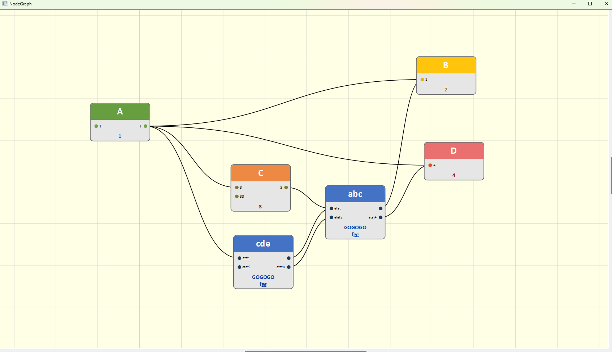

# py_node_graph

### Requirement:

- PyQt5
- Python 3.x

### Description

This is a naive implementation of node graph with PyQt.

Just run main.py

Right-click to open menu

### Shortcut:

- Ctrl+S: save
- Ctrl+L: load
- Ctrl+N: New graph

